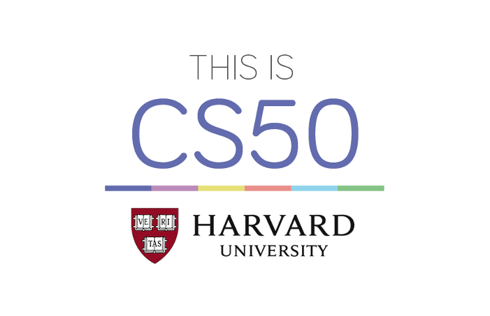

## CS50x: Introduction to Computer Science

This course teaches students how to think algorithmically and solve problems efficiently. Topics include abstraction, algorithms, data structures, encapsulation, resource management, security, software engineering, and web development. Languages include C, Python, SQL, and JavaScript plus CSS and HTML. Problem sets inspired by real-world domains of biology, cryptography, finance, forensics, and gaming. Designed for majors and non-majors alike, with or without prior programming experience.

**Codes implementations here are my solutions to CS50 problem sets**

## Expectations

+ Submit nine problem sets and
+ Submit a final project.

## Lectures

|Lectures     |Topics|
|:-----------------|------------:|
|[Week 0][0] |Scratch|
|[Week 1][1] |C|
|[Week 2][2] |Arrays|
|[Week 3][3] |Algorithms|
|[Week 4][4] |Memory|
|[Week 5][5] |Data Structures|
|[Week 6][6] |HTTP|
|[Week 7][7] |Machine Learning|
|[Week 8][8] |Python|
|[Week 9][9] |SQL|
|[Week 10][10] |JavaScript|
|[Week 11][11] |The End / Final Project|

## Problem Sets

A summary of problem sets appears below

|Problem Set|	|Language|
|:----------------------|:-----:|:-------------:|
|[Problem Set 0][pset0] |Scratch|Scratch|
|[Problem Set 1][pset1] |C|C|
|[Problem Set 2][pset2] |Crypto|C|
|[Problem Set 3][pset3] |Game of Fifteen|C|
|[Problem Set 4][pset4] |Forensics|C|
|[Problem Set 5][pset5] |Mispellings|C|
|[Problem Set 6][pset6] |Sentimental|Python|
|[Problem Set 7][pset7] |C$50 Finance|Python, SQL|
|[Problem Set 8][pset8] |Mashup|JavaScript|
|[Final Project][final] |Any|Any|

## Website
https://cs50.edx.org/

## Credits
[Professor David J. Malan](https://github.com/dmalan "Teaches CS50 at Harvard")
[Brian Yu](https://github.com/brianyu28 "Head Course Assistant for CS50")
[Zamyla Chan](https://cs50.harvard.edu "Walkthrough Videos")
[Doug Lloyd](https://cs50.harvard.edu "Section Videos")
[Rob Bowden](https://cs50.harvard.edu "SuperSections")
[StackOverFlow](https://stackoverflow.com "Provides solution when stuck")
[Sololearn](https://sololearn.com "Beginner's guide plus Question & Answer forum")

[pset0]: pset0/

[pset1]: pset1/

[pset2]: pset2/

[pset3]: pset3/

[pset4]: pset4/

[pset5]: pset5/

[pset6]: pset6/

[pset7]: pset7/

[pset8]: pset8/

[final]: final_project/

[0]: https://courses.edx.org/courses/course-v1:HarvardX+CS50+X/courseware/d0c88865e9434f17808f54870ea230a1/5b52cf0573bb4c9ab8bc979e728b2446/

[1]: https://courses.edx.org/courses/course-v1:HarvardX+CS50+X/courseware/d0c88865e9434f17808f54870ea230a1/da6b01d04a5643e796a4ec904db9363c/

[2]: https://courses.edx.org/courses/course-v1:HarvardX+CS50+X/courseware/d0c88865e9434f17808f54870ea230a1/e7180a2d0f4445878d0e74f6ddbde944/

[3]: https://courses.edx.org/courses/course-v1:HarvardX+CS50+X/courseware/d0c88865e9434f17808f54870ea230a1/423d8aa02ac945acb41fdb3fa5e8af88/

[4]: https://courses.edx.org/courses/course-v1:HarvardX+CS50+X/courseware/d0c88865e9434f17808f54870ea230a1/04d14ed5bcaf4d7fae80b6e0772fd1c7/

[5]: https://courses.edx.org/courses/course-v1:HarvardX+CS50+X/courseware/d0c88865e9434f17808f54870ea230a1/9096126aaf144aab9fa4aeb8ad9eb938/

[6]: https://courses.edx.org/courses/course-v1:HarvardX+CS50+X/courseware/d0c88865e9434f17808f54870ea230a1/3bc1fc6f3ec949eebc726673d164fff8/

[7]: https://courses.edx.org/courses/course-v1:HarvardX+CS50+X/courseware/d0c88865e9434f17808f54870ea230a1/9bd6a0559c6d4a6d923a94375347efc0/

[8]: https://courses.edx.org/courses/course-v1:HarvardX+CS50+X/courseware/d0c88865e9434f17808f54870ea230a1/5f245ed1b5004cdcb2f37a09ea90f05d/

[9]: https://courses.edx.org/courses/course-v1:HarvardX+CS50+X/courseware/d0c88865e9434f17808f54870ea230a1/59d12907a77f4f4d8d24b831003b6962/

[10]: https://courses.edx.org/courses/course-v1:HarvardX+CS50+X/courseware/d0c88865e9434f17808f54870ea230a1/6f7f4b3b4f89444ea4f32563569fe093/

[11]: https://courses.edx.org/courses/course-v1:HarvardX+CS50+X/courseware/d0c88865e9434f17808f54870ea230a1/51ce7ee1ff8b46019f32c6cc729f307b/
