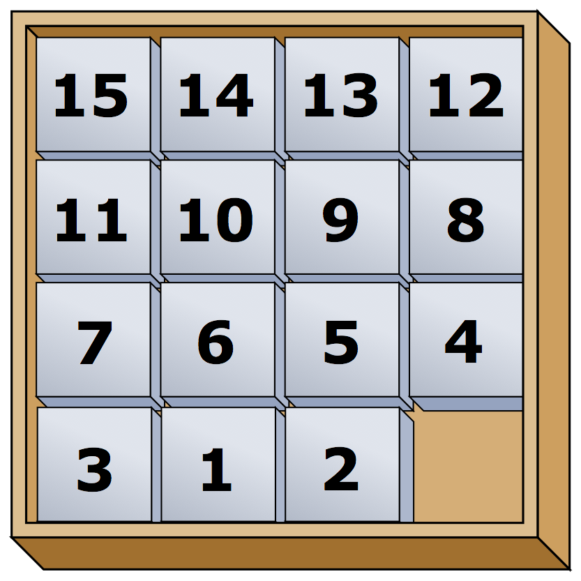

## Game of Fifteen

Fix the puzzle by arranging the numbers accordingly




## Objectives

+ Implement the [Game of Fifteen][fifteen], per the comments in fifteen.c.

+ Implement init function.

+ Implement draw function.

+ Implement move function.

+ Implement won function.

## Compiling & Testing

Compile and play:

```c
make fifteen

./fifteen
```


Testing solutions:

`./fifteen 3 < 3x3.txt`

`./fifteen 4 < 4x4.txt`

## Links

+ [Problem Set 3](http://docs.cs50.net/2017/x/psets/3/pset3.html)

+ [Game of Fifteen][fifteen]


[fifteen]: http://docs.cs50.net/problems/fifteen/fifteen.html "Game of Fifteen specifications"
