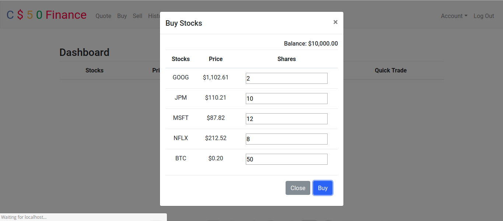
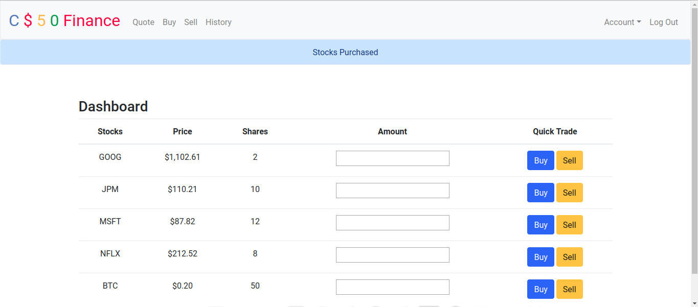
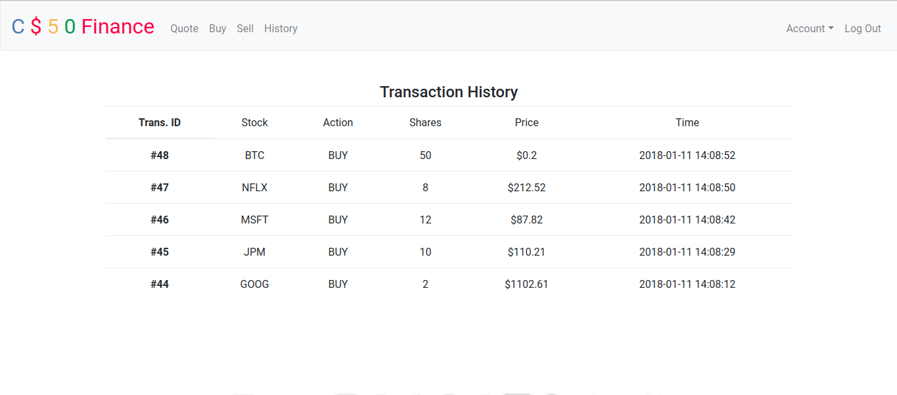

## C$50 Finance

Build a stock-trading website

## Objectives

+ Complete the implementation of register

+ Complete the implementation of quote

+ Complete the implementation of buy

+ Complete the implementation of index

+ Complete the implementation of sell

+ Complete the implementation of history

+ Implement one (1) additional feature, a personal touch of your choice:

    + Empower users to change their passwords.

    + Empower users to add additional cash to their account.

    + Empower users to buy more shares or sell shares of stocks they already own via index itself, without having to type stocks' symbols manually.

    + Empower users with some other feature of comparable scope.

## Requirements

+ Python 3.6.x (and above)

## Setup

Install dependencies:

`pip3.6 install --user -r requirements.txt`

Configure database:

`python3.6 ./config.py`

Start server:

`./serve`

## Screenshots

Purchase Window of C$50 Finance

Display of user's stocks

User's transaction history

## Links

+ [Problem Set 7](http://docs.cs50.net/2017/x/psets/7/pset7.html)

+ [C$50 Finance][finance]

[finance]: http://docs.cs50.net/problems/finance/finance.html "C$50 Finance specifications"
