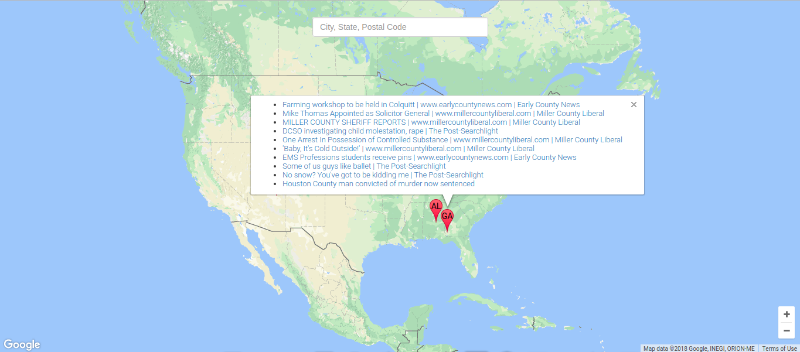

## Mashup

Build a news map website

## Objectives

+ Complete the implementation of articles

+ Complete the implementation of search

+ Complete the implementation of configure

+ Complete the implementation of script.js

    + Implement addMarker in scripts.js

    + Implement removeMarker in scripts.js

## Requirements

+ Python 3.6.x (and above)

## Setup

Install dependencies:

`pip3.6 install --user -r requirements.txt`

Configure database:

`sqlite3 --separator "\t" "mashup.db" --init "./config"`

Start server:

`./serve`

## Screenshots

Google News Map

## Links

+ [Problem Set 8](http://docs.cs50.net/2017/x/psets/8/pset8.html)

+ [Mashup][mashup]

[mashup]: http://docs.cs50.net/problems/mashup/mashup.html "Mashup specifications"
